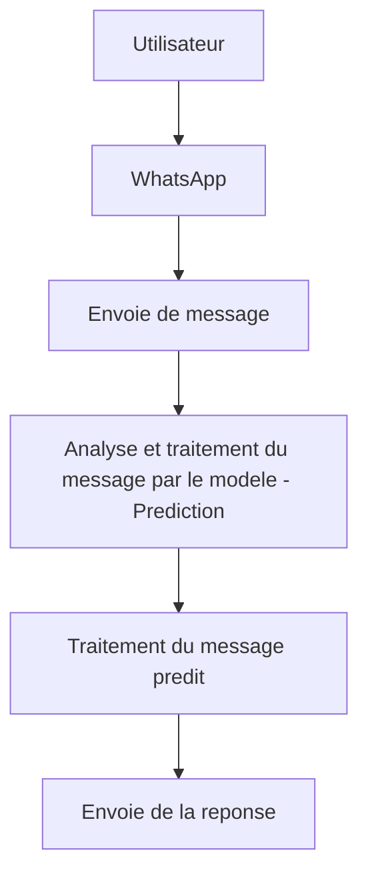

# Systeme intelligent de transport 

## Presentation du projet:

Ce projet consiste a assister automatiquement les utilisateurs dans leur demande a travers whatsapp.

L'objectif principal est de permettre a un utilisateur d'effectuer un **recherche de voyage** ou de demander le **prix d'un trajet** en utilisant simplement un message naturel.

Exemple:

    Je veux aller a Antananarivo

                ou

    Combien coute le trajet majunga antananarivo

Le modèle analyse automatiquement le message afin d'identifier les informations nécessaires à la recherche, notamment :

Les entités:  
📍 le lieu de départ (Departure)  
📍 la destination (Destination)  
📅 la date du voyage (Date)  

Les intentions:  
🔎 recherche de voyage (`travel_search`)  
💰 demande de prix (`price_request`)

##### Autre fonctionnalite:
Toutefois , le modele detecte aussi le trait "greetings" et la langue utilise par l'utilisateur (francais(fr) ou malagasy(mg)).

### Fonctionnement general:


## Lancer le projet

Après avoir cloné le dépôt, installez les dépendances nécessaires avec :

```bash
npm install
```

Une fois l'installation terminée, démarrez le projet avec :

```bash
npm start
```

Si le qr code ne s'affiche pas, reessayer avec : 

```bash
node index.js
```

Au démarrage, un **QR Code WhatsApp** s'affiche dans le terminal.

Pour connecter le compte WhatsApp utilisé par l'application :

1. Ouvrez **WhatsApp** sur votre téléphone.
2. Accédez à **Appareils connectés**.
3. Sélectionnez **Connecter un appareil**.
4. Scannez le QR Code affiché dans le terminal.

Une fois le compte connecté, l'application peut recevoir les messages envoyés à ce compte et y répondre automatiquement à l'aide du système d'intelligence artificielle.

> **Remarque 1:** le compte WhatsApp qui scanne le QR Code devient le compte utilisé par l'application pour recevoir et envoyer les messages.
> **Remarque 2:** Creer un fichier .env a la racine de votre projet et mettez-y tout ce qui se trouve dans le fichier 
 .env.template et remplace les valeurs.

## Documentation d'utilisation de Cap.ai

**Cap.ai** est le modèle d'intelligence artificielle utilisé par le projet. Il est fourni au format **`.onnx`**, ce qui permet de l'utiliser avec différentes technologies compatibles avec ONNX, notamment **JavaScript**.

### Structure du modèle

Les fichiers nécessaires au fonctionnement de Cap.ai sont regroupés dans :

```text
src/model_scripts/
```

L'ensemble de ces fichiers est nécessaire pour effectuer correctement une prédiction avec le modèle.

Le modèle ne doit donc pas être utilisé seul : le tokenizer, le prétraitement, les constantes, le post-traitement et les autres fichiers associés doivent également être conservés.

### Personnalisation

Parmi les composants du modèle, **seul le `dateparser` est conçu pour être personnalisé**.

Il peut notamment être adapté pour ajouter de nouvelles expressions de dates ou modifier les règles permettant d'interpréter les dates en français et en malagasy.

Le reste des fichiers ne doit pas être modifié sans modifier également le modèle ou le pipeline utilisé lors de son entraînement, car une modification peut entraîner des prédictions incorrectes.

### Dépendances nécessaires

Pour utiliser Cap.ai dans une application JavaScript, les dépendances suivantes sont nécessaires :

```bash
npm install onnxruntime-node fastest-levenshtein
```

Elles permettent notamment :

* `onnxruntime-node` : charger et exécuter le modèle `.onnx` ;
* `fastest-levenshtein` : effectuer la comparaison approximative utilisée notamment par le traitement des expressions du `dateparser` et les entitées villes.

### Dépendances supplémentaires pour WhatsApp

Les dépendances suivantes sont uniquement nécessaires pour intégrer Cap.ai à WhatsApp :

```bash
npm install qrcode-terminal whatsapp-web.js
```

Elles permettent :

* `whatsapp-web.js` : communiquer avec WhatsApp Web et recevoir ou envoyer des messages ;
* `qrcode-terminal` : afficher dans le terminal le QR Code permettant de connecter le compte WhatsApp.

Ainsi, **Cap.ai peut être utilisé indépendamment de WhatsApp**. Les dépendances WhatsApp sont uniquement nécessaires lorsque le modèle est intégré au système de messagerie.

### Prediction

Pour tester directement le modele et effectuer une prediction, utilisez le script :

    prediction/predict.js

Ce script permet de verifier rapidement le fonctionnement du modele et observer les resultats de ses predictions
